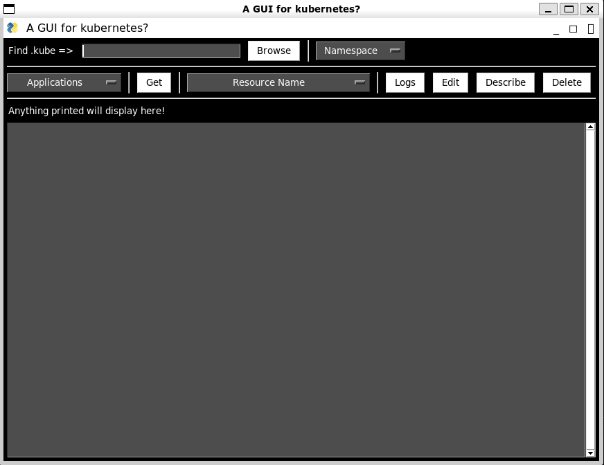

# Simple Kubernetes GUI handler

This repo is specifically designed to match the requirements and 
configuration of the current organisation I'm working on. 
Just for the context `managed Kubernetes service on Amazon EKS`.
It provides a pretty stupid and simple graphical interface
for handling the different kubernetes resources.
 

## Infos

It is written completely in `Python` and specifically used 
the [`PySimpleGui Interface`](https://www.pysimplegui.org/en/latest/).

It runs on both Windows and Unix environments. 
Tested on Windows 11 and Windows subsystem for Linux.

## Local Testing
The testing is made with minikube.
Run `kubect proxy --port=8080 &` to enable a local machine to have access 
to the kubernetes API

## TODOS

- Handle Errors (ATM I assume the configuration is done properly)
- Generalize the pre-required configuration from within the app
- Add nodes event support, not only for the POD
- Create Tab-like Interface for showing always the PODS/NODES resources
  - Implemented, not tested due to currents simple Minikube's configuration
- Add Support for running custom command on cluster
- Add support for editing Kubernetes resources from within the app
